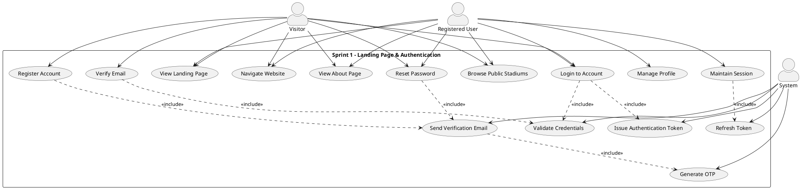

```plantuml
@startuml Sprint 1 - Use Case Diagram

skinparam actorStyle awesome
skinparam packageStyle rectangle
skinparam usecaseStyle roundbox

actor "Visitor" as visitor
actor "Registered User" as user
actor "System" as system

rectangle "Sprint 1 - Landing Page & Authentication" {
  ' Landing Page Use Cases
  usecase "View Landing Page" as UC1
  usecase "Navigate Website" as UC2
  usecase "Browse Public Stadiums" as UC3
  usecase "View About Page" as UC4
  
  ' Authentication Use Cases
  usecase "Register Account" as UC5
  usecase "Verify Email" as UC6
  usecase "Login to Account" as UC7
  usecase "Reset Password" as UC8
  usecase "Manage Profile" as UC9
  usecase "Maintain Session" as UC10
  
  ' System Use Cases
  usecase "Send Verification Email" as UC11
  usecase "Generate OTP" as UC12
  usecase "Validate Credentials" as UC13
  usecase "Issue Authentication Token" as UC14
  usecase "Refresh Token" as UC15
}

' Visitor Relationships
visitor --> UC1
visitor --> UC2
visitor --> UC3
visitor --> UC4
visitor --> UC5
visitor --> UC6
visitor --> UC7
visitor --> UC8

' User Relationships
user --> UC7
user --> UC8
user --> UC9
user --> UC10
user --> UC1
user --> UC2
user --> UC3
user --> UC4

' System Relationships
system --> UC11
system --> UC12
system --> UC13
system --> UC14
system --> UC15

' Include/Extend Relationships
UC5 ..> UC11 : <<include>>
UC11 ..> UC12 : <<include>>
UC6 ..> UC13 : <<include>>
UC7 ..> UC13 : <<include>>
UC7 ..> UC14 : <<include>>
UC10 ..> UC15 : <<include>>
UC8 ..> UC11 : <<include>>

@enduml
```
