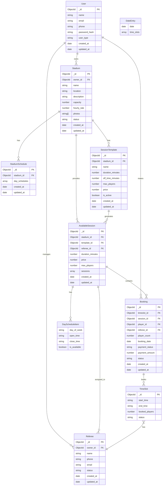

# Database Schema Visualization

  

## Entity Relationship Diagram

  

  

## Database Schema Details

  

### User Collection

- **Fields:**

- `_id`: ObjectId (Primary Key)

- `name`: String (Required)

- `email`: String (Required, Unique)

- `phone`: String (Required)

- `password_hash`: String (Required, min length 8)

- `user_type`: String (Enum: 'admin', 'owner', 'player', Default: 'player')

- `created_at`: Date

- `updated_at`: Date

- **Behaviors:**

- Password hashing using bcrypt

- Password verification method

  

### Stadium Collection

- **Fields:**

- `_id`: ObjectId (Primary Key)

- `owner_id`: ObjectId (Foreign Key to User)

- `name`: String (Required)

- `location`: String (Required)

- `description`: String (Required)

- `capacity`: Number (Required)

- `hourly_rate`: Number (Required)

- `photos`: Array of Strings

- `status`: String (Enum: 'active', 'inactive', 'maintenance', Default: 'active')

- `created_at`: Date

- `updated_at`: Date

- **Virtual Fields:**

- `daySchedules`: StadiumSchedule objects related to this stadium

- `sessionTemplates`: SessionTemplate objects related to this stadium

- `availableSessions`: AvailableSession objects related to this stadium

  

### StadiumSchedule Collection

- **Fields:**

- `_id`: ObjectId (Primary Key)

- `stadium_id`: ObjectId (Foreign Key to Stadium, Unique)

- `day_schedules`: Array of DayScheduleItem subdocuments

- `created_at`: Date

- `updated_at`: Date

- **Validation:**

- Each day of week can only appear once

- Closing time must be after opening time

  

### DayScheduleItem Subdocument

- **Fields:**

- `day_of_week`: String (Enum: days of week)

- `open_time`: String (Format: HH:MM)

- `close_time`: String (Format: HH:MM)

- `is_available`: Boolean (Default: true)

  

### SessionTemplate Collection

- **Fields:**

- `_id`: ObjectId (Primary Key)

- `stadium_id`: ObjectId (Foreign Key to Stadium)

- `name`: String (Required)

- `duration_minutes`: Number (Required, min: 15)

- `off_time_minutes`: Number (Default: 0)

- `max_players`: Number (Required, min: 1)

- `price`: Number (Required, min: 0)

- `is_active`: Boolean (Default: true)

- `created_at`: Date

- `updated_at`: Date

- **Virtual Fields:**

- `availableSessions`: AvailableSession objects related to this template

  

### AvailableSession Collection

- **Fields:**

- `_id`: ObjectId (Primary Key)

- `stadium_id`: ObjectId (Foreign Key to Stadium)

- `template_id`: ObjectId (Foreign Key to SessionTemplate)

- `referee_id`: ObjectId (Foreign Key to Referee, Optional)

- `duration_minutes`: Number (Required)

- `price`: Number (Required)

- `max_players`: Number (Required)

- `sessions`: Array of DateEntry objects

- `created_at`: Date

- `updated_at`: Date

- **Indexes:**

- Compound index on `stadium_id` and `template_id`

- Index on `sessions.date`

- Index on `referee_id`

- **Methods:**

- `findTimeSlot`: Find a specific time slot by ID

- `updateTimeSlotBooking`: Update booking count and status for a time slot

  

### DateEntry Subdocument

- **Fields:**

- `date`: Date (Required)

- `time_slots`: Array of TimeSlot objects

  

### TimeSlot Subdocument

- **Fields:**

- `_id`: ObjectId

- `start_time`: String (Format: HH:MM, Required)

- `end_time`: String (Format: HH:MM, Required)

- `booked_players`: Number (Default: 0)

- `status`: String (Enum: 'available', 'partial', 'booked', 'cancelled', 'completed', Default: 'available')

  

### Booking Collection

- **Fields:**

- `_id`: ObjectId (Primary Key)

- `timeslot_id`: ObjectId (Reference to TimeSlot _id)

- `session_id`: ObjectId (Foreign Key to AvailableSession)

- `player_id`: ObjectId (Foreign Key to User)

- `referee_id`: ObjectId (Foreign Key to Referee, Optional)

- `player_count`: Number (Default: 1, min: 1)

- `booking_date`: Date (Default: current date)

- `payment_status`: String (Enum: 'pending', 'paid', 'refunded', 'failed', Default: 'pending')

- `payment_amount`: Number (Required)

- `status`: String (Enum: 'pending', 'confirmed', 'cancelled', 'completed', 'no-show', 'rejected', Default: 'pending')

- `created_at`: Date

- `updated_at`: Date

- **Indexes:**

- Unique index on `timeslot_id` and `player_id` (A player can only book a specific time slot once)

- **Behaviors:**

- Pre-save verification of time slot availability

  

### Referee Collection

- **Fields:**

- `_id`: ObjectId (Primary Key)

- `owner_id`: ObjectId (Foreign Key to User)

- `name`: String (Required)

- `phone`: String (Required)

- `email`: String (Required)

- `status`: String (Enum: 'active', 'inactive', 'busy', Default: 'active')

- `created_at`: Date

- `updated_at`: Date

- **Virtual Fields:**

- `assignedSessions`: AvailableSession objects related to this referee